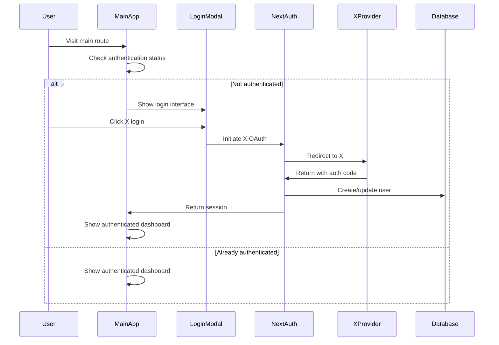
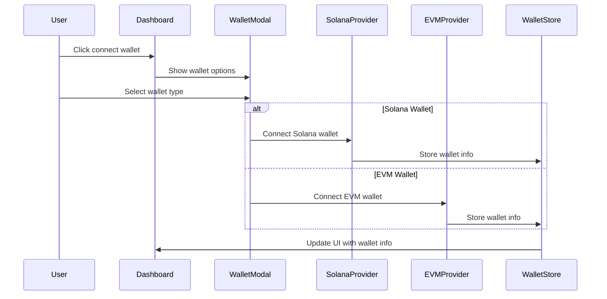

# Design Document

## Overview

This design integrates X (Twitter) authentication and wallet connection functionality into the main application route. The implementation will reuse existing authentication patterns from the invite route while adapting them for the main dashboard interface. The solution maintains consistency with the current architecture using NextAuth for X authentication and the existing wallet providers for crypto wallet connections.

## Architecture

### Authentication Flow



### Wallet Connection Flow



## Components and Interfaces

### 1. Authentication Components

#### MainAuthGuard Component

- **Purpose**: Wrapper component that checks authentication status for main route
- **Location**: `packages/web/src/components/MainAuthGuard.tsx`
- **Props**:
  ```typescript
  interface MainAuthGuardProps {
    children: React.ReactNode
    fallback?: React.ReactNode
  }
  ```
- **Functionality**:
  - Uses `useSession` to check authentication status
  - Renders children if authenticated
  - Shows login interface if not authenticated

#### MainLoginModal Component

- **Purpose**: Login modal specifically for main application
- **Location**: `packages/web/src/components/MainLoginModal.tsx`
- **Props**:
  ```typescript
  interface MainLoginModalProps {
    open: boolean
    onClose: () => void
  }
  ```
- **Functionality**:
  - Reuses styling from existing LoginButton modal
  - Handles X authentication flow
  - Provides consistent branding and UX

### 2. Wallet Connection Components

#### WalletConnectionPanel Component

- **Purpose**: Panel showing wallet connection status and options
- **Location**: `packages/web/src/components/WalletConnectionPanel.tsx`
- **Props**:
  ```typescript
  interface WalletConnectionPanelProps {
    className?: string
  }
  ```
- **Functionality**:
  - Shows connected wallets
  - Provides connect/disconnect options
  - Displays wallet addresses and balances

#### ConnectWalletModal Component

- **Purpose**: Modal for selecting and connecting wallets
- **Location**: `packages/web/src/components/ConnectWalletModal.tsx`
- **Props**:
  ```typescript
  interface ConnectWalletModalProps {
    open: boolean
    onClose: () => void
    walletType?: 'solana' | 'evm' | 'all'
  }
  ```
- **Functionality**:
  - Lists available wallet options
  - Handles wallet connection flow
  - Integrates with existing wallet providers

### 3. User Profile Components

#### AuthenticatedUserInfo Component

- **Purpose**: Display authenticated user information
- **Location**: `packages/web/src/components/AuthenticatedUserInfo.tsx`
- **Props**:
  ```typescript
  interface AuthenticatedUserInfoProps {
    showWallets?: boolean
    compact?: boolean
  }
  ```
- **Functionality**:
  - Shows X profile information (avatar, name, username)
  - Displays connected wallet information
  - Provides logout option

## Data Models

### Extended Session Type

```typescript
// Extend existing NextAuth session type
interface ExtendedSession extends Session {
  user: {
    id: string
    twitterId: string
    userId: number
    name: string
    image: string
    username: string
    referralCode: string
    status: string
    // ... other existing fields
  }
}
```

### Wallet Connection State

```typescript
// Extend existing wallet store state
interface WalletConnectionState {
  isConnecting: boolean
  connectionError: string | null
  lastConnectedWallet: string | null
  preferredWalletType: 'solana' | 'evm' | null
}
```

## Error Handling

### Authentication Errors

- **X OAuth Failures**: Display user-friendly error messages with retry options
- **Session Expiry**: Automatically redirect to login with session restoration
- **Network Errors**: Show offline indicators and retry mechanisms

### Wallet Connection Errors

- **Wallet Not Found**: Guide users to install wallet extensions
- **Connection Rejected**: Provide clear instructions for manual connection
- **Network Mismatch**: Prompt users to switch to correct network

### Error Display Strategy

```typescript
interface ErrorDisplayConfig {
  type: 'toast' | 'modal' | 'inline'
  duration?: number
  retryable: boolean
  actionLabel?: string
  onAction?: () => void
}
```

## Testing Strategy

### Unit Tests

- **Authentication Components**: Test login/logout flows, session handling
- **Wallet Components**: Test connection/disconnection, state management
- **Error Handling**: Test various error scenarios and recovery

### Integration Tests

- **Auth Flow**: End-to-end X authentication process
- **Wallet Integration**: Multi-wallet connection scenarios
- **Session Persistence**: Page refresh and navigation scenarios

### Component Tests

- **Modal Interactions**: Login and wallet connection modals
- **State Synchronization**: Authentication and wallet state consistency
- **Responsive Design**: Mobile and desktop layouts

## Implementation Phases

### Phase 1: Authentication Integration

1. Create MainAuthGuard component
2. Implement MainLoginModal component
3. Update main layout to include authentication check
4. Test X authentication flow

### Phase 2: Wallet Connection

1. Create WalletConnectionPanel component
2. Implement ConnectWalletModal component
3. Integrate with existing wallet providers
4. Test multi-wallet scenarios

### Phase 3: User Interface Integration

1. Create AuthenticatedUserInfo component
2. Update Header component to show user info
3. Implement logout functionality
4. Polish UI and responsive design

### Phase 4: Error Handling and Polish

1. Implement comprehensive error handling
2. Add loading states and transitions
3. Optimize performance and bundle size
4. Complete testing coverage

## Security Considerations

### Authentication Security

- Validate X OAuth tokens server-side
- Implement proper session management
- Use secure HTTP-only cookies for session storage
- Implement CSRF protection

### Wallet Security

- Never store private keys or sensitive wallet data
- Validate wallet signatures properly
- Implement proper wallet disconnection cleanup
- Use secure communication with wallet providers

### Data Protection

- Minimize stored user data
- Implement proper data encryption
- Follow GDPR compliance for user data
- Secure API endpoints with proper authentication

## Performance Considerations

### Code Splitting

- Lazy load authentication components
- Split wallet provider bundles
- Optimize modal component loading

### State Management

- Minimize re-renders during authentication
- Optimize wallet state updates
- Implement proper cleanup on unmount

### Bundle Optimization

- Tree-shake unused wallet adapters
- Optimize authentication library imports
- Minimize CSS bundle size
